---
## Front matter
title: "Лабораторная работа №2"
subtitle: "Компьютерный практикум по статистическому анализу данных"
author: "Еюбоглу Тимур"

## Generic otions
lang: ru-RU
toc-title: "Содержание"

## Bibliography
bibliography: bib/cite.bib
csl: pandoc/csl/gost-r-7-0-5-2008-numeric.csl

## Pdf output format
toc: true # Table of contents
toc-depth: 2
lof: true # List of figures
lot: true # List of tables
fontsize: 12pt
linestretch: 1.5
papersize: a4
documentclass: scrreprt
## I18n polyglossia
polyglossia-lang:
  name: russian
  options:
  - spelling=modern
  - babelshorthands=true
polyglossia-otherlangs:
  name: english
## I18n babel
babel-lang: russian
babel-otherlangs: english
## Fonts
mainfont: IBM Plex Serif
romanfont: IBM Plex Serif
sansfont: IBM Plex Sans
monofont: IBM Plex Mono
mathfont: STIX Two Math
mainfontoptions: Ligatures=Common,Ligatures=TeX,Scale=0.94
romanfontoptions: Ligatures=Common,Ligatures=TeX,Scale=0.94
sansfontoptions: Ligatures=Common,Ligatures=TeX,Scale=MatchLowercase,Scale=0.94
monofontoptions: Scale=MatchLowercase,Scale=0.94,FakeStretch=0.9
mathfontoptions:
## Biblatex
biblatex: true
biblio-style: "gost-numeric"
biblatexoptions:
  - parentracker=true
  - backend=biber
  - hyperref=auto
  - language=auto
  - autolang=other*
  - citestyle=gost-numeric
## Pandoc-crossref LaTeX customization
figureTitle: "Рис."
tableTitle: "Таблица"
listingTitle: "Листинг"
lofTitle: "Список иллюстраций"
lotTitle: "Список таблиц"
lolTitle: "Листинги"
## Misc options
indent: true
header-includes:
  - \usepackage{indentfirst}
  - \usepackage{float} # keep figures where there are in the text
  - \floatplacement{figure}{H} # keep figures where there are in the text
---

# Цель работы

Основная цель работы — изучить несколько структур данных, реализованных в Julia, 
научиться применять их и операции над ними для решения задач.
 
# Выполнение лабораторной работы

##  Кортежи

Кортеж (Tuple) — структура данных (контейнер) в виде неизменяемой индексируемой 
последовательности элементов какого-либо типа (элементы индексируются с единицы). 

Синтаксис определения кортежа: (element1, element2, ...). 

Примеры кортежей (рис. [-@fig:001]):

{#fig:001 width=100% height=100%}

Примеры операций над кортежами (рис. [-@fig:002]):

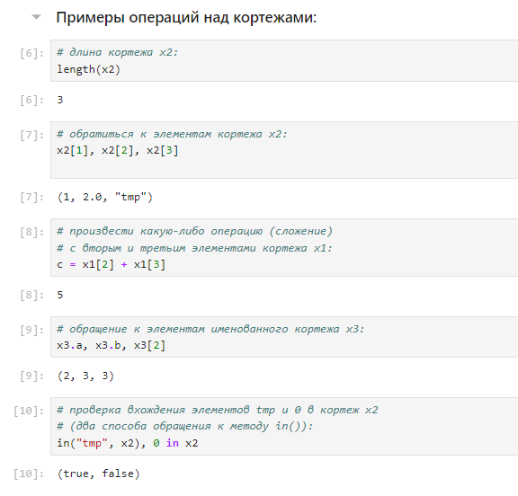{#fig:002 width=100% height=100%}

##  Словари

Словарь — неупорядоченный набор связанных между собой по ключу данных. 

Синтаксис определения словаря: Dict(key1 => value1, key2 => value2, ...). 

Примеры словарей и операций над ними (рис. [-@fig:003]):

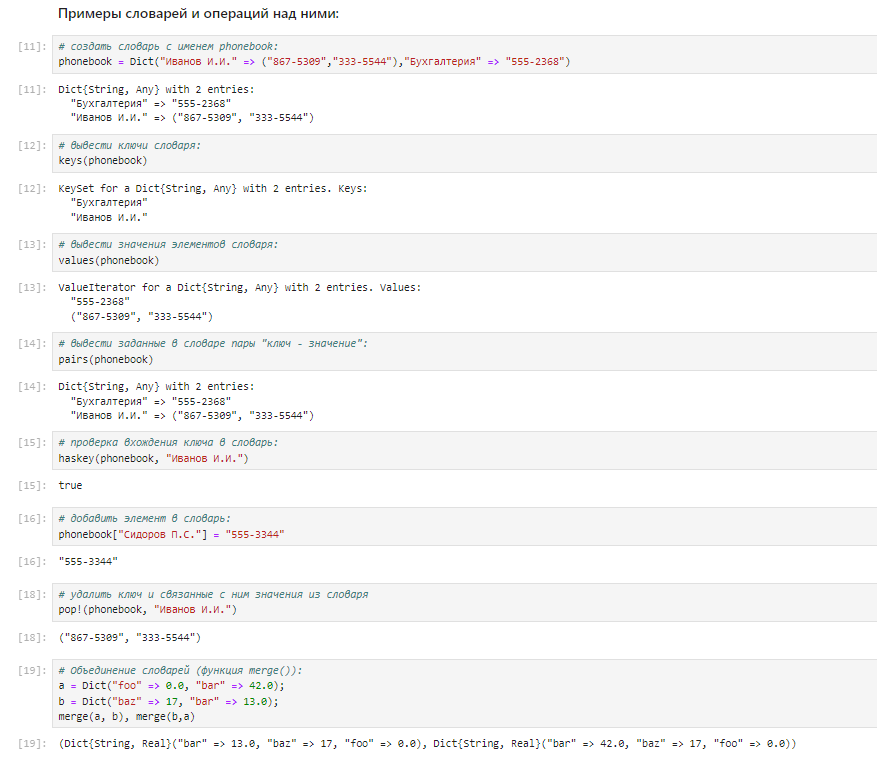{#fig:003 width=100% height=100%}

## Множества

Множество, как структура данных в Julia, соответствует множеству, как математическому объекту, 
то есть является неупорядоченной совокупностью элементов какого-либо типа. 
Возможные операции над множествами: объединение, пересечение, разность; принадлежность элемента множеству.

Синтаксис определения множества: Set([itr]) где itr — набор значений, сгенерированных данным итерируемым объектом или пустое 
множество.

Примеры множеств и операций над ними (рис. [-@fig:004] - рис. [-@fig:005]):

{#fig:004 width=100% height=100%}

{#fig:005 width=100% height=100%}

## Массивы

Массив — коллекция упорядоченных элементов, размещённая в многомерной сетке. Векторы и матрицы являются частными случаями массивов.

Общий синтаксис одномерных массивов: array_name_1 = [element1, element2, ...], array_name_2 = [element1 element2 ...]

Примеры массивов (рис. [-@fig:006] - рис. [-@fig:007]):

{#fig:006 width=100% height=100%}

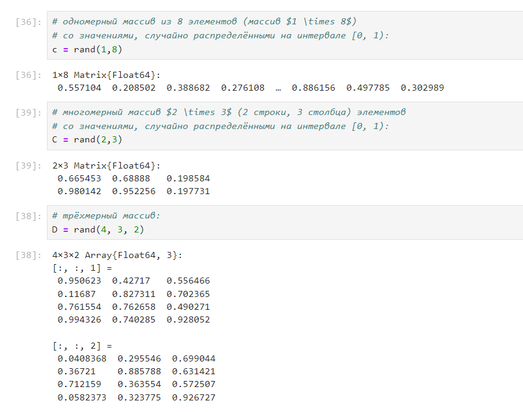{#fig:007 width=100% height=100%}

Примеры массивов, заданных некоторыми функциями через включение (рис. [-@fig:008]):

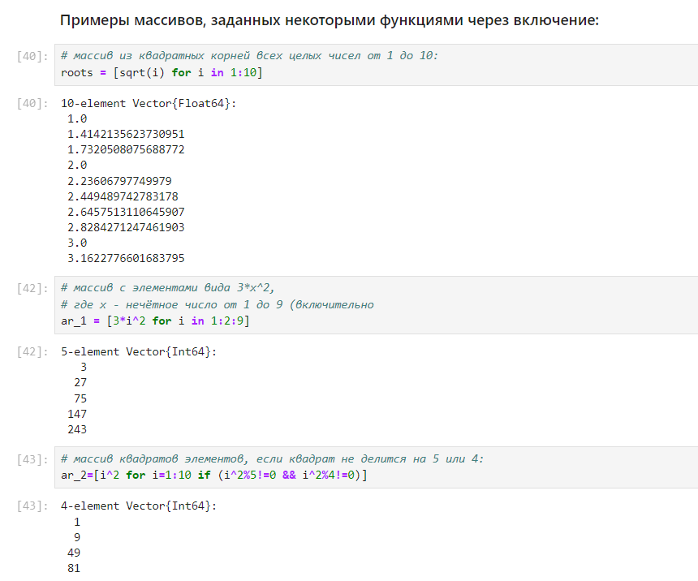{#fig:008 width=100% height=100%}

Некоторые операции для работы с массивами: (рис. [-@fig:009] - рис. [-@fig:014]):

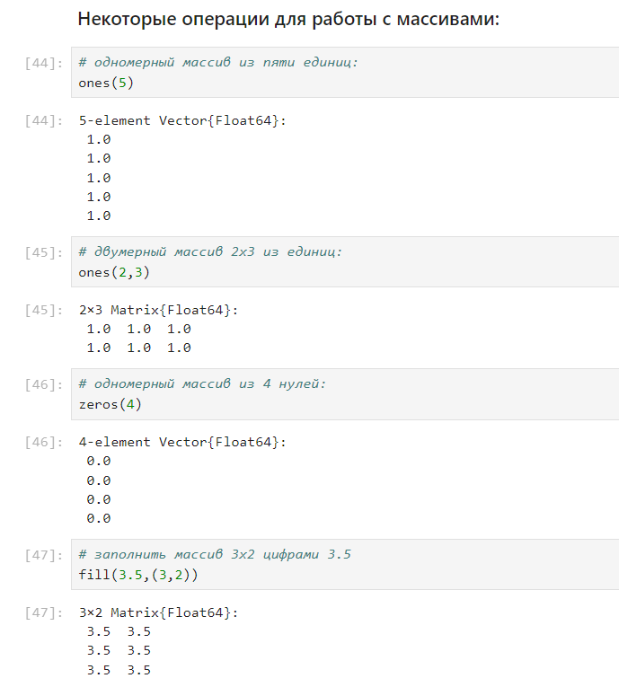{#fig:009 width=100% height=100%}

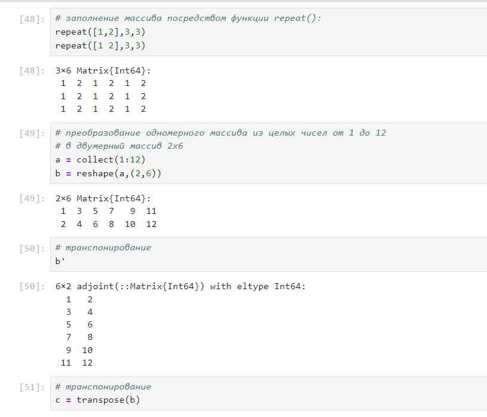{#fig:010 width=100% height=100%}

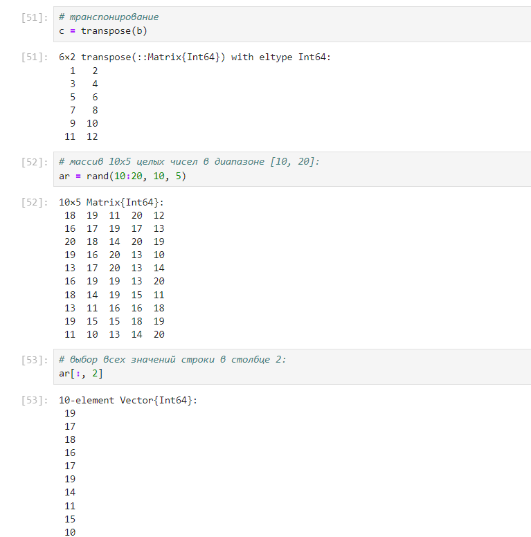{#fig:011 width=100% height=100%}

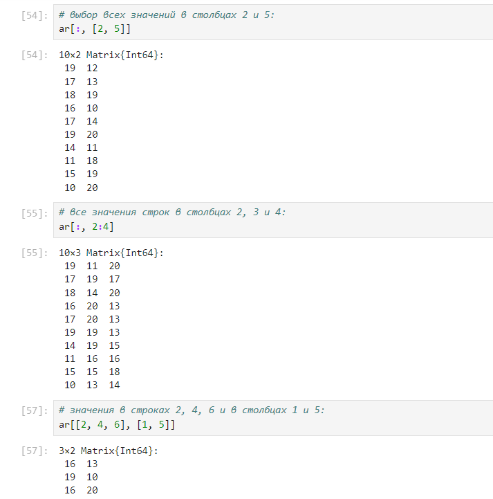{#fig:012 width=100% height=100%}

{#fig:013 width=100% height=100%}

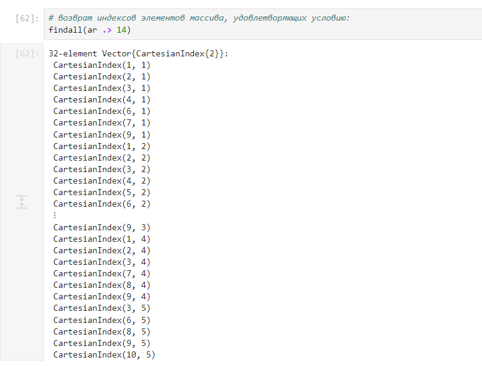{#fig:014 width=100% height=100%}

## Самостоятельная работа

Выполнение заданий №1 и №2 (рис. [-@fig:015]):

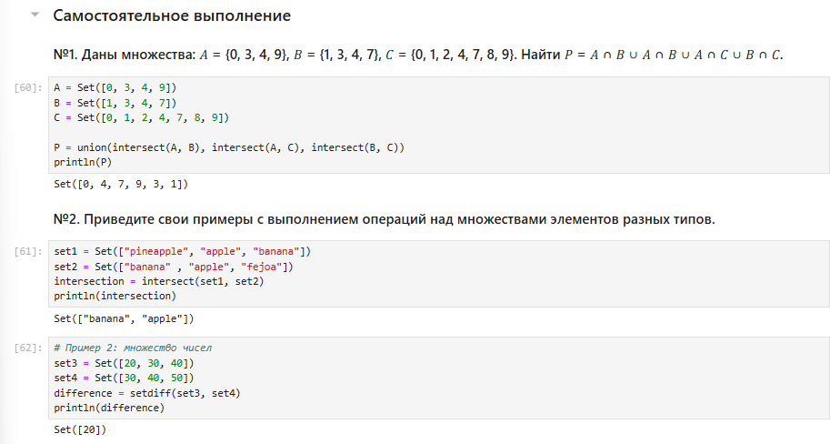{#fig:015 width=100% height=100%}

Выполнение задания №3 (всех подпунктов) (рис. [-@fig:016] - рис. [-@fig:020]):

{#fig:016 width=100% height=100%}

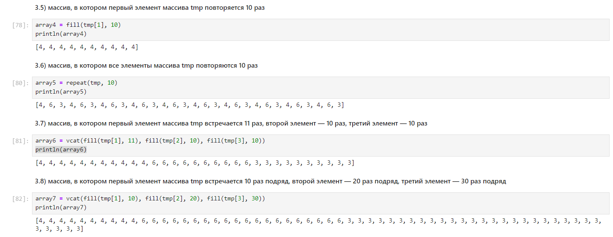{#fig:017 width=100% height=100%}

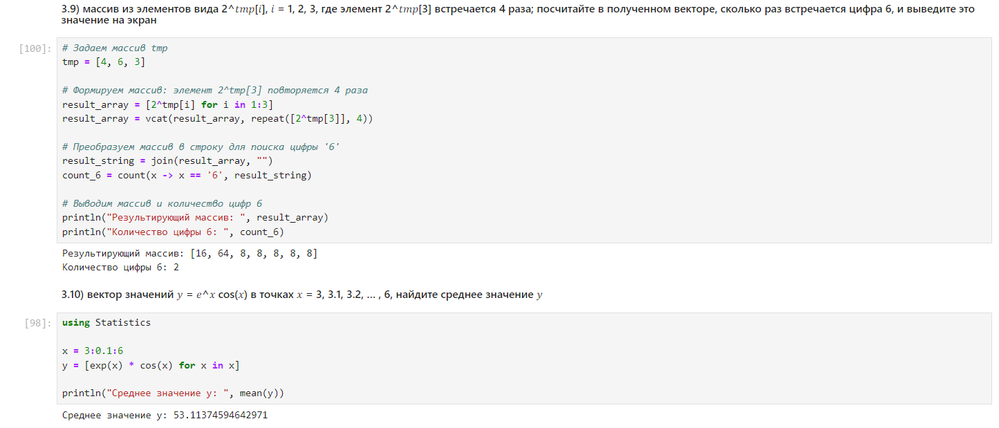{#fig:018 width=100% height=100%}

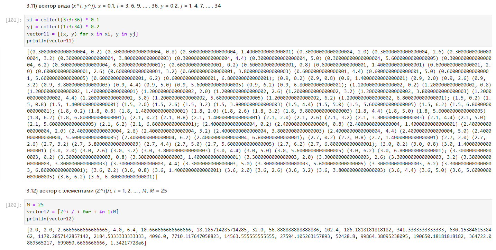{#fig:019 width=100% height=100%}

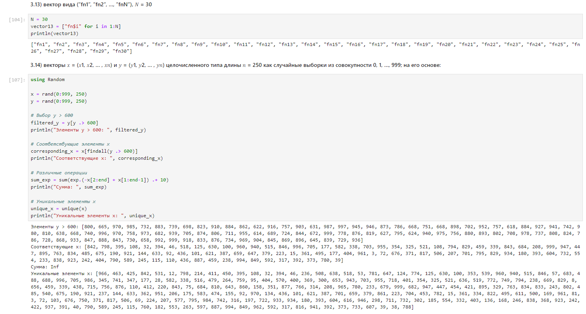{#fig:020 width=100% height=100%}

Выполнение заданий №4, №5 и №6 (рис. [-@fig:021]):

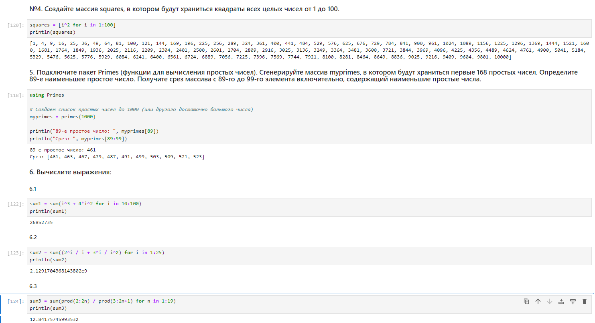{#fig:021 width=100% height=10}

# Вывод

В ходе выполнения лабораторной работы были изучены несколько структур данных, реализованных в Julia, 
а также научились применять их и операции над ними для решения задач.

# Список литературы. Библиография

[1] Julia Documentation: https://docs.julialang.org/en/v1/